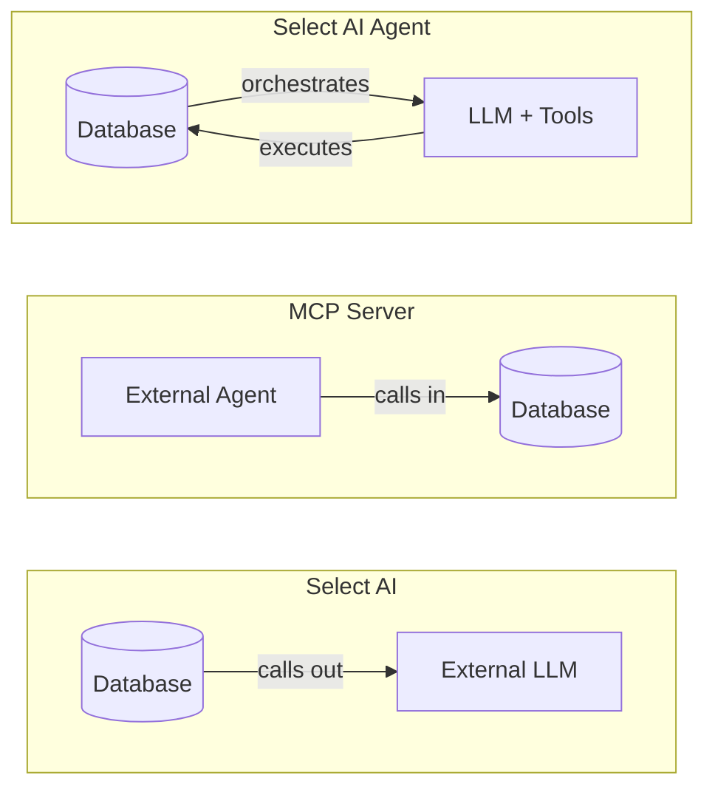

# Three Ways to Connect AI to Oracle Database (And When to Use Each)

Oracle now offers three different ways to connect AI to your database. At first glance, this looks like product sprawl—the kind of thing that makes engineers groan and reach for a decision matrix. But here's the thing: they're not competing options. They're layers.

## Give Credit Where It's Due

If you're confused about SQLcl MCP, Autonomous MCP, and Select AI, that confusion is reasonable. The names don't help, and the marketing materials tend to focus on features rather than explaining when you'd actually pick one over another.

The good news is there's real thought behind the design. Each technology exists because it solves a genuinely different problem. Once you understand the core difference—which direction the data flows—the choice becomes obvious.

## The Actual Difference

Here's what matters: **Where does the LLM live, and who controls it?**

Select AI lives inside the database. You write `SELECT AI 'show me top customers'` from SQL Developer, and the database calls out to an external LLM (OpenAI, Cohere, whatever you've configured). The database handles the prompt, augments it with schema metadata, and executes the resulting SQL. Your application doesn't even know AI was involved—it just gets rows back.

MCP Server flips this around. An external AI agent—Claude, Copilot, your own thing—calls into the database. The agent controls the reasoning. The database just executes what it's told. This is the "outside-in" pattern.

Select AI Agent is the middle ground: you build autonomous agents that run inside the database, with their own reasoning loops, tools, and memory. Think automated report generation or data quality workflows that run on a schedule without human prompting.

## Why Three Technologies Exist

Oracle didn't build three products because they couldn't pick one. They built three because enterprises have genuinely different needs.

A business analyst running ad-hoc queries from an APEX dashboard wants Select AI. They don't want to install anything or configure agents. They want to type a question and get an answer. The database handling the LLM call means IT can control costs, security, and which models are allowed—without touching end-user machines.

A developer using Claude Code or Cursor wants MCP. They're already in an AI-powered IDE. They want their existing agent to understand their database. The agent should be able to query, explore schemas, even help tune queries—all without switching context. SQLcl MCP gives you five tools: connect, disconnect, run SQL, run SQLcl commands, and list connections. Simple and focused.

A team building automated workflows wants Select AI Agent. Maybe you're generating compliance reports every night. Maybe you're running data validation with an LLM that can reason about edge cases. This is agentic AI that runs unattended, inside the database where it has native access to everything.

## The Layered Architecture

Here's what the documentation doesn't make obvious enough: these technologies build on each other.

Select AI provides the NL2SQL foundation. Select AI Agent uses that foundation to enable multi-step workflows with custom tools. And Autonomous MCP exposes those agent tools to the outside world via HTTP.

So when an external Claude instance connects to Autonomous MCP, it can invoke tools you've registered with Select AI Agent. The layers compose. You're not choosing between them—you're choosing where to start.

For developers on non-Autonomous databases (on-prem Oracle 19c, 23ai, or the free container), SQLcl MCP is currently your only option. It works great for local development. The limitation is it runs locally via stdio, not over HTTP. Enterprise deployment requires workarounds like containerizing SQLcl behind a proxy.

## Which One Should You Use?

Start with these questions:

If you control the LLM and want NL2SQL from SQL clients: **Select AI**.

If you're using an external AI agent (Claude, Copilot, Cursor) and want it to query Oracle: **MCP Server**. Use SQLcl MCP for any Oracle database, Autonomous MCP if you're on ADB and want custom tools or HTTP access.

If you're building automated AI workflows that run inside the database: **Select AI Agent**.

Most enterprises will eventually use all three. The APEX dashboard gets Select AI. The developer team gets MCP. The overnight batch jobs get Select AI Agent. They coexist.

## One Thing to Remember

Always review generated SQL before executing. These tools make databases more accessible, but an LLM can still write bad queries—or correct ones that return data you didn't intend to expose. The security features are solid (VPD, Data Redaction, SQL Firewall all work), but the last line of defense is still a human reading what's about to run.

---

*Victor Martin Alvarez is a Senior Principal Product Manager at Oracle, where he thinks about how developers interact with databases—and occasionally which of the three AI integration options to recommend for any given Tuesday.*
