# Oracle Database AI Integration

## Connecting LLMs to Enterprise Data

_Presentation Draft for PowerPoint_

---

## Slide 1: Title

# Oracle Database AI Integration

### SQLcl MCP | Autonomous MCP | Select AI

**Empowering Enterprise AI with Secure Database Access**

_Victor Martin Alvarez | [JAn 29th, 2026]_

---

## Slide 2: The AI-Database Challenge

### What Customers Are Asking

> "How can we let AI assistants safely query our Oracle databases?"

> "We want natural language access to our data, but security is non-negotiable."

> "Can developers use Claude or Copilot with our production data?"

### The Reality

- **80% of enterprise data** lives in databases
- AI assistants are transforming how we work
- But connecting AI to databases raises critical questions:
  - Security & Audit
  - Data Privacy
  - Access Control

---

## Slide 3: Oracle's Three-Pronged Solution

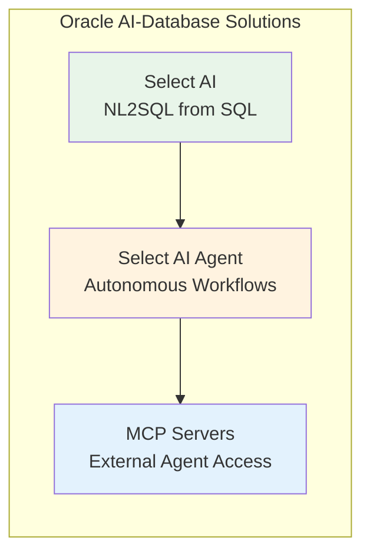

| Solution            | Direction             | Key Use Case              |
| ------------------- | --------------------- | ------------------------- |
| **Select AI**       | Database → LLM        | NL2SQL for business users |
| **Select AI Agent** | Database orchestrates | Autonomous workflows      |
| **MCP Servers**     | LLM → Database        | Developer AI assistants   |

---

## Slide 4: Understanding the Flow

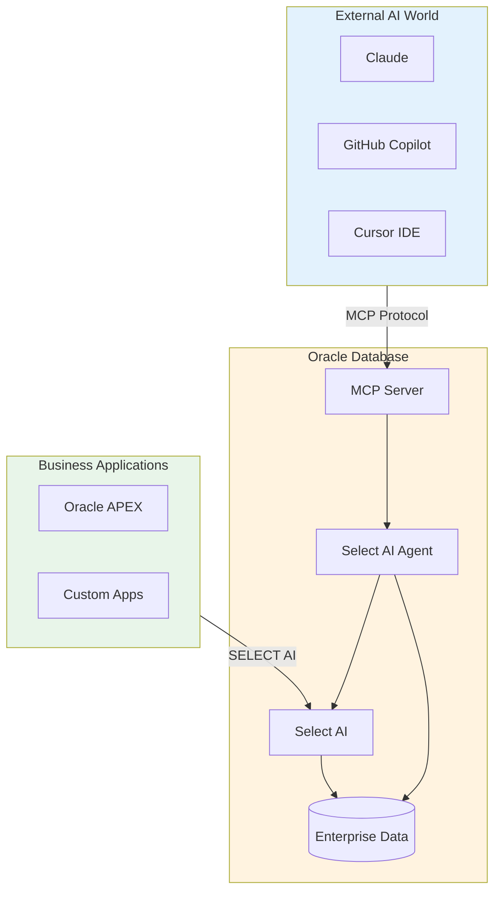

---

# Part 1: Select AI

---

## Slide 5: Select AI - Natural Language to SQL

### What Is It?

**SQL access to generative AI** — execute natural language queries directly from SQL

### The Magic

```sql
SELECT AI 'What are my top 10 customers by revenue?';
```

The database:

1. Augments your prompt with schema metadata
2. Calls your chosen LLM (OpenAI, Cohere, OCI GenAI)
3. Generates and executes optimized SQL
4. Returns results

---

## Slide 6: Select AI Architecture

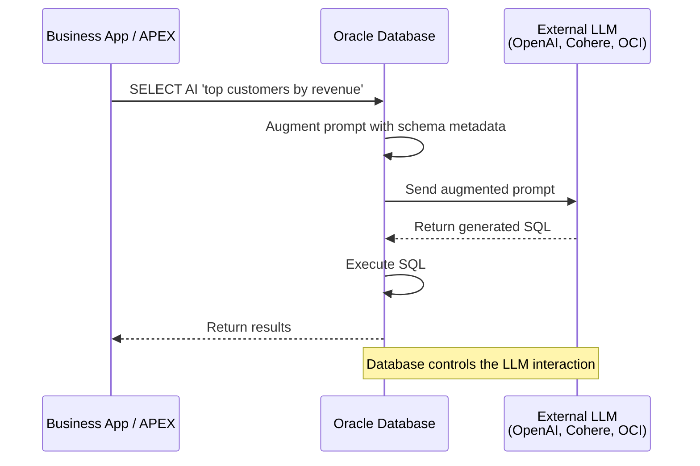

### Key Point

**The database calls OUT to the LLM** — you control which model, which data is exposed

---

## Slide 7: Select AI Capabilities

| Action       | What It Does                 | Example                               |
| ------------ | ---------------------------- | ------------------------------------- |
| `runsql`     | Generate & execute SQL       | `SELECT AI 'customers in California'` |
| `showsql`    | Show generated SQL only      | `SELECT AI showsql 'top orders'`      |
| `narrate`    | Natural language explanation | `SELECT AI narrate 'revenue trends'`  |
| `chat`       | General conversation         | `SELECT AI chat 'what is ATP?'`       |
| `explainsql` | Explain a query              | `SELECT AI explainsql 'SELECT...'`    |

### Availability

- Oracle Autonomous Database (since 2023)
- Works from any SQL client, APEX, OML notebooks

---

# Part 2: Select AI Agent

---

## Slide 8: Select AI Agent - Autonomous Workflows

### What Is It?

**Build autonomous AI agents inside the database** using the ReAct pattern (Reasoning and Acting)

### Beyond Single Queries

- Multi-turn conversations with memory
- Custom tools (PL/SQL functions, REST APIs)
- Human-in-the-loop approval
- Agent teams for complex tasks

### Availability

- Oracle AI Database 26ai (October 2025)

---

## Slide 9: Select AI Agent Architecture

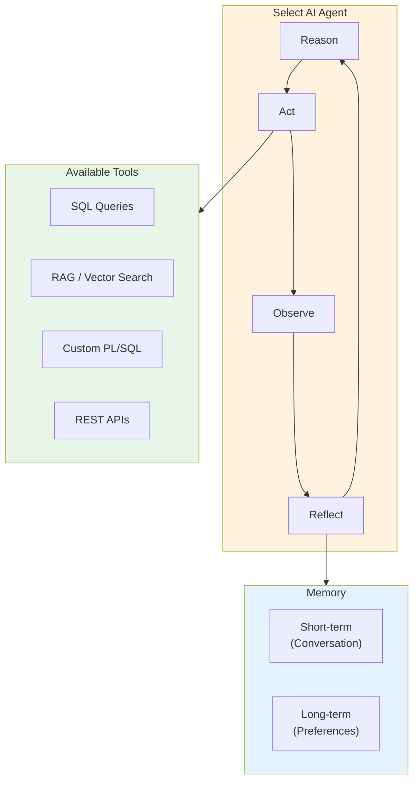

---

## Slide 10: Select AI Agent Example

```sql
-- Create a sales advisor agent
BEGIN
  DBMS_CLOUD_AI_AGENT.CREATE_AGENT(
    agent_name  => 'SALES_ADVISOR',
    attributes  => '{"profile_name": "OCI_GENAI",
                     "role": "Sales analyst expert"}',
    description => 'Analyzes sales and provides recommendations'
  );
END;
/

-- Run the agent
SELECT DBMS_CLOUD_AI_AGENT.RUN_AGENT(
  agent_name => 'SALES_ADVISOR',
  prompt     => 'What are the sales trends in EMEA?'
) FROM DUAL;
```

### The Agent Will:

1. Reason about the question
2. Query relevant tables
3. Analyze patterns
4. Provide recommendations

---

# Part 3: SQLcl MCP Server

---

## Slide 11: SQLcl MCP Server - Developer AI Assistants

### What Is It?

**Let Claude, Copilot, and Cursor query your Oracle databases**

### The Model Context Protocol (MCP)

- Open standard by Anthropic (November 2024)
- JSON-RPC 2.0 over stdio
- Oracle was an early adopter

### Availability

- SQLcl 25.2+ (GA July 2025)
- Works with ANY Oracle Database (19c, 21c, 23ai, 26ai)

---

## Slide 12: SQLcl MCP Architecture

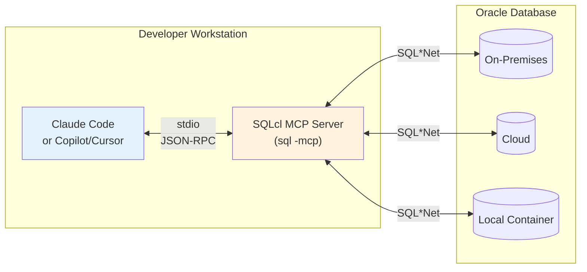

### Key Point

**Runs locally** — credentials stay on developer's machine

---

## Slide 13: SQLcl MCP Tools

| Tool               | Purpose                                   |
| ------------------ | ----------------------------------------- |
| `list-connections` | Discover saved database connections       |
| `connect`          | Establish session using saved credentials |
| `disconnect`       | End the database session                  |
| `run-sql`          | Execute SQL and PL/SQL                    |
| `run-sqlcl`        | Run SQLcl commands (Data Pump, AWR, etc.) |

### Example Interaction

```
Developer: "Connect to sales_db and show me the top 5 customers"

Claude: [calls list-connections]
        [calls connect("sales_db")]
        [generates SQL]
        [calls run-sql]
        "Here are your top 5 customers..."
```

---

## Slide 14: SQLcl MCP Security

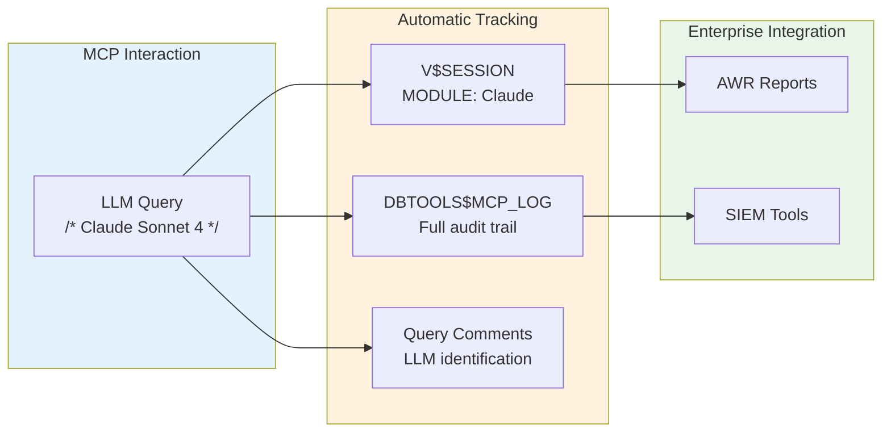

### Enterprise-Grade Audit

- Every query tagged with LLM model name
- Full session tracking in V$SESSION
- Dedicated audit table for compliance

---

# Part 4: Autonomous MCP Server

---

## Slide 15: Autonomous MCP Server - Enterprise Scale

### What Is It?

**Fully managed MCP server built into Autonomous Database**

### Key Differences from SQLcl MCP

| SQLcl MCP        | Autonomous MCP |
| ---------------- | -------------- |
| Local (stdio)    | Remote (HTTP)  |
| Fixed 5 tools    | Custom tools   |
| User-managed     | Fully managed  |
| Single developer | Multi-user     |

### Availability

- Oracle Autonomous AI Database (GA December 2025)

---

## Slide 16: Autonomous MCP Architecture

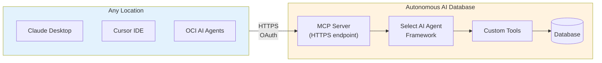

### Key Point

**MCP exposes Select AI Agent tools** — create once, use from any AI assistant

---

## Slide 17: Autonomous MCP Security Layers

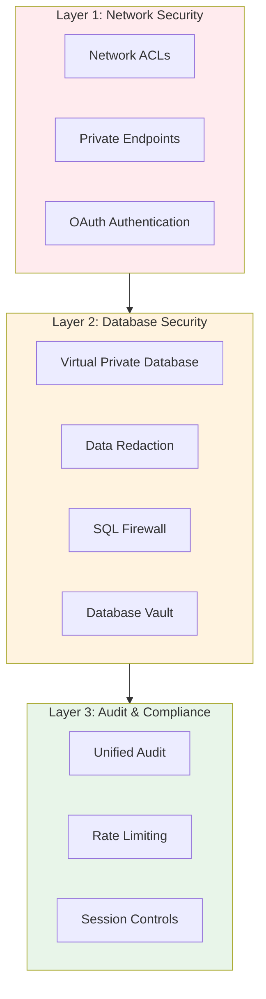

### Enterprise Security Stack

All existing Oracle security features work seamlessly with MCP

---

# Part 5: Comparison & Decision Guide

---

## Slide 18: When to Use What?

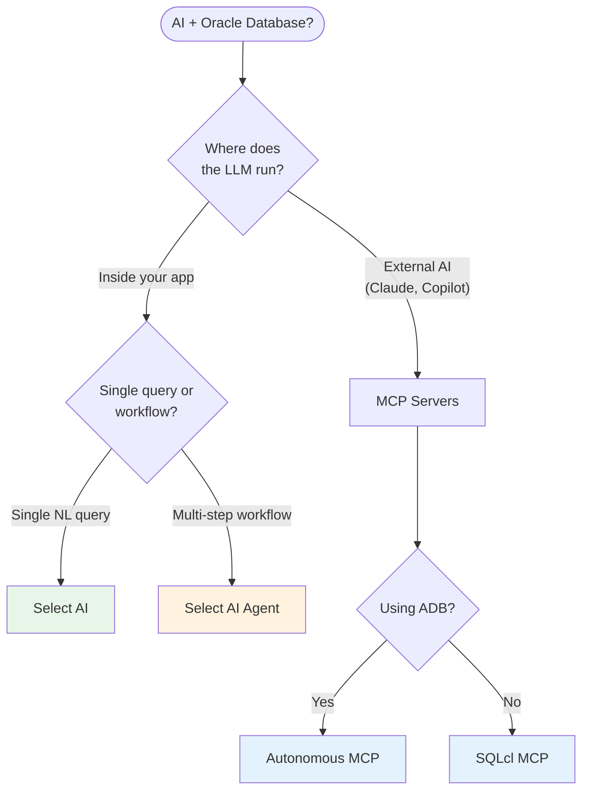

---

## Slide 19: Feature Comparison

| Capability       | Select AI     | Select AI Agent | SQLcl MCP     | Autonomous MCP |
| ---------------- | ------------- | --------------- | ------------- | -------------- |
| **Interface**    | SQL           | PL/SQL          | JSON-RPC      | JSON-RPC       |
| **LLM Choice**   | You configure | You configure   | Agent's LLM   | Agent's LLM    |
| **Custom Tools** | No            | Yes             | No            | Yes            |
| **Memory**       | Conversation  | Short + Long    | Agent manages | Agent manages  |
| **Transport**    | N/A           | N/A             | Local (stdio) | Remote (HTTP)  |
| **Multi-user**   | Yes           | Yes             | No            | Yes            |
| **OAuth**        | N/A           | N/A             | No            | Yes            |
| **Availability** | ADB 2023+     | ADB 26ai        | SQLcl 25.2+   | ADB Dec 2025   |

---

## Slide 20: Layered Architecture

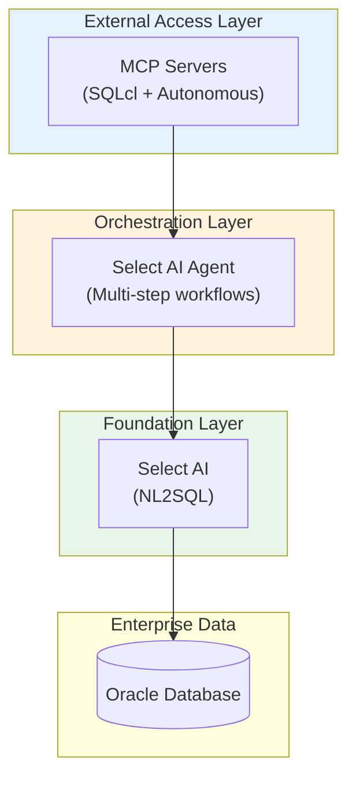

### They're Complementary

An enterprise might use ALL THREE:

- **Select AI** in APEX dashboards
- **Select AI Agent** for automated workflows
- **MCP Servers** for developer AI assistants

---

# Part 6: Industry Use Cases

---

## Slide 21: Financial Services

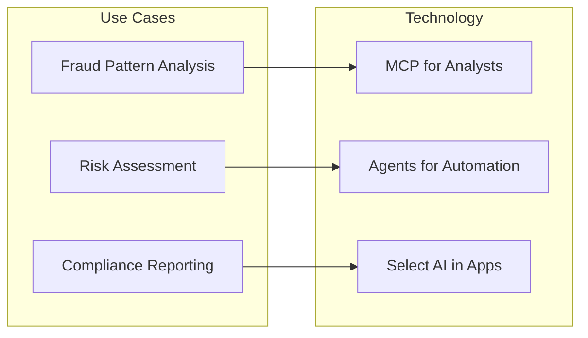

| Use Case                     | Solution        | Example                                           |
| ---------------------------- | --------------- | ------------------------------------------------- |
| **Ad-hoc fraud analysis**    | SQLcl MCP       | "Show unusual transactions in the last 24 hours"  |
| **Automated risk workflows** | Select AI Agent | Daily risk score calculations with human approval |
| **Compliance dashboards**    | Select AI       | Natural language queries in APEX                  |

---

## Slide 22: Healthcare & Life Sciences

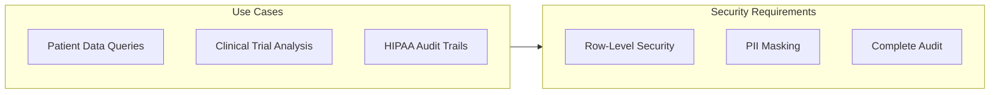

| Use Case              | Solution         | Security Feature                         |
| --------------------- | ---------------- | ---------------------------------------- |
| **Patient queries**   | Select AI        | VPD policies limit to authorized records |
| **Clinical analysis** | MCP + Autonomous | Data redaction masks sensitive fields    |
| **Audit compliance**  | All solutions    | Unified audit + DBTOOLS$MCP_LOG          |

---

## Slide 23: Retail & E-Commerce

| Use Case                 | Solution        | Business Value                           |
| ------------------------ | --------------- | ---------------------------------------- |
| **Inventory queries**    | Select AI       | Store managers ask "What's running low?" |
| **Sales trend analysis** | SQLcl MCP       | Analysts use Claude to explore data      |
| **Automated reordering** | Select AI Agent | Agent monitors stock, triggers orders    |
| **Customer 360**         | Autonomous MCP  | Support uses AI with secure data access  |

### Example Flow

```
Support Agent: "Show me customer John Smith's order history"
Claude + MCP: [Connects securely, queries with VPD, redacts PII]
              "Here are John's 15 orders this year..."
```

---

## Slide 24: Manufacturing & Supply Chain

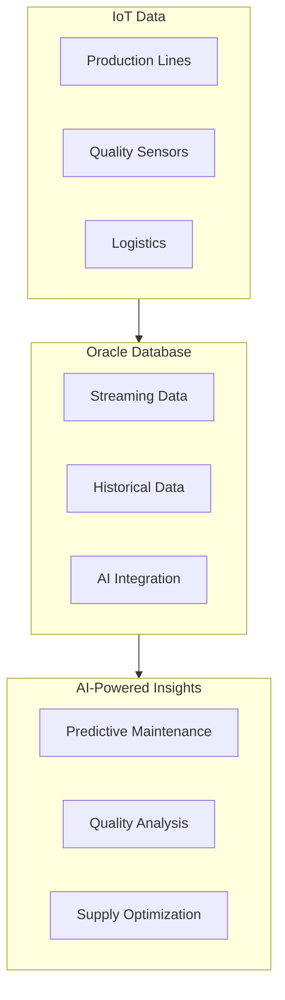

| Use Case                   | Solution        | Example                                        |
| -------------------------- | --------------- | ---------------------------------------------- |
| **Maintenance prediction** | Select AI Agent | "Analyze machine X patterns, predict failures" |
| **Quality investigation**  | SQLcl MCP       | Engineers query defect data with Claude        |
| **Supply optimization**    | Select AI       | Dashboard queries in natural language          |

---

## Slide 25: Public Sector

| Use Case              | Solution        | Compliance                           |
| --------------------- | --------------- | ------------------------------------ |
| **Citizen queries**   | Select AI       | FOIA-compliant with redaction        |
| **Budget analysis**   | SQLcl MCP       | Analysts explore spending patterns   |
| **Case management**   | Select AI Agent | Automated case routing with approval |
| **Cross-agency data** | Autonomous MCP  | Secure multi-tenant access           |

### Security Highlight

Oracle's MCP solutions are the ONLY ones with:

- FedRAMP-ready infrastructure (ADB)
- Complete audit trails for compliance
- Fine-grained access control (VPD, Database Vault)

---

# Part 7: Live Demo

---

## Slide 26: Demo Architecture

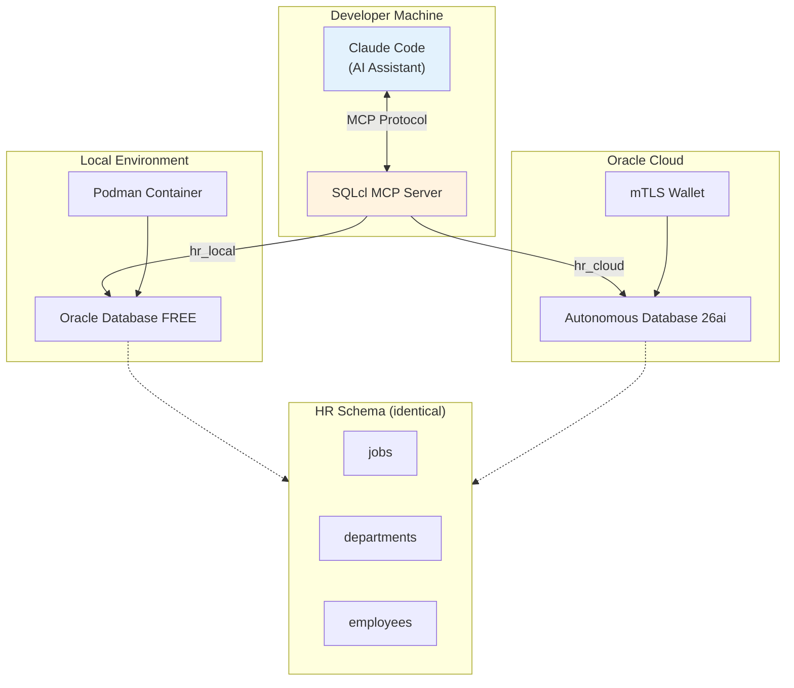

---

## Slide 27: Demo - What We'll Show

### Data Queries

```
"Connect to hr_local and list all employees"
"Show employees by department with their managers"
"What's the salary distribution across departments?"
```

### Database Administration

```
"What is the character-set of the hr_local database?"
"Explain the execution plan for: SELECT * FROM employees"
"What indexes exist on the employees table?"
```

### Cross-Database

```
"Compare employee counts between hr_local and hr_cloud"
```

---

## Slide 28: Demo - Behind the Scenes

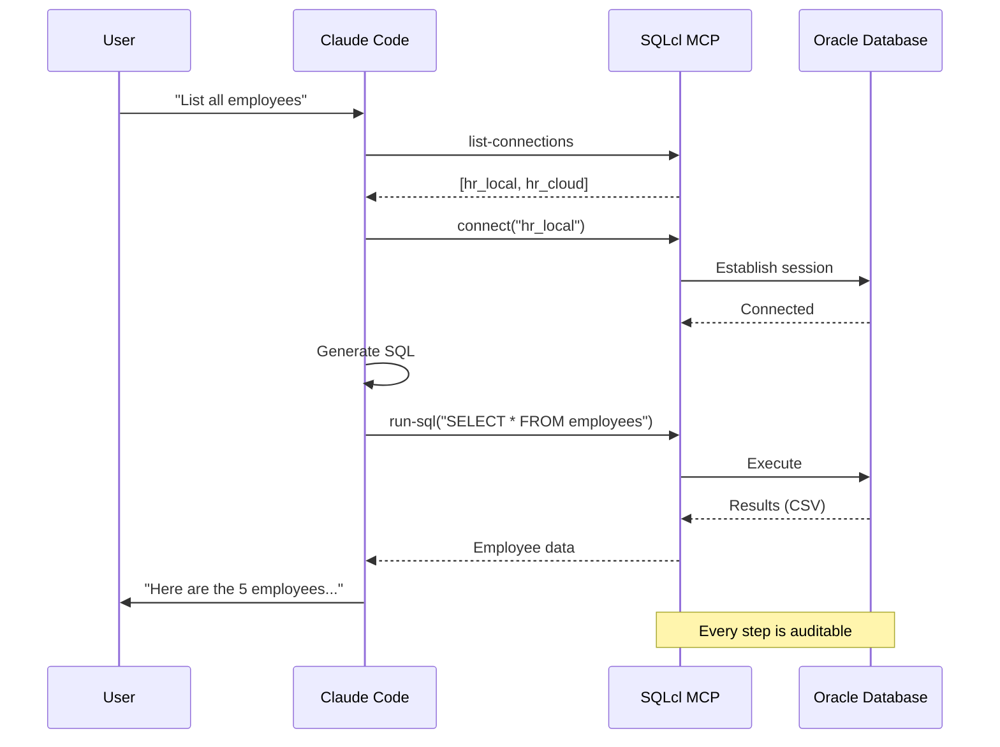

---

# Part 8: Roadmap

---

## Slide 29: Oracle Database MCP Evolution

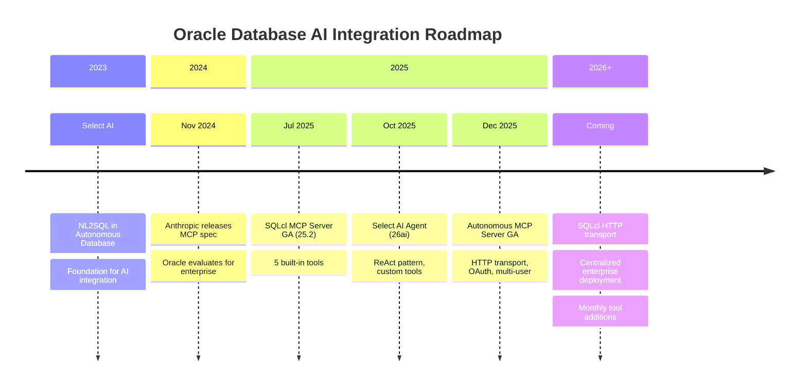

---

## Slide 30: What's Coming

| Feature                          | Status         | Impact                             |
| -------------------------------- | -------------- | ---------------------------------- |
| **SQLcl HTTP transport**         | In development | Centralized deployment without ADB |
| **Monthly tool additions**       | Ongoing        | Expanding SQLcl capabilities       |
| **Select AI Agent enhancements** | Continuous     | More built-in tools, better memory |
| **MCP specification updates**    | Tracking       | Oracle follows Anthropic standard  |

### Current Workaround for Centralized SQLcl

Red Hat OpenShift container: `quay.io/rh-ai-quickstart/oracle-sqlcl:0.5.11`

---

# Part 9: Competitive Position

---

## Slide 31: Market Comparison

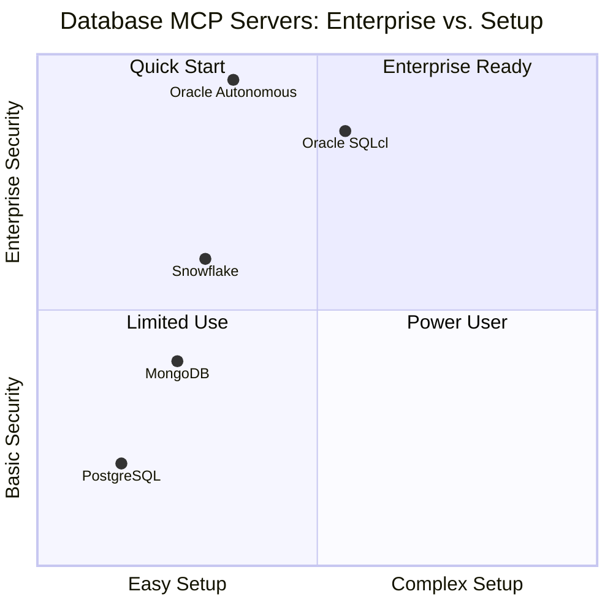

---

## Slide 32: Oracle's Competitive Advantages

| Advantage                     | What It Means                                   |
| ----------------------------- | ----------------------------------------------- |
| **Security instrumentation**  | Most comprehensive audit in the market          |
| **Query tagging**             | Every AI query identifiable in AWR/SIEM         |
| **Enterprise security stack** | VPD, Redaction, SQL Firewall, Database Vault    |
| **DBA capabilities**          | Data Pump, AWR, Data Guard via MCP              |
| **Converged database**        | One connection: relational, JSON, graph, vector |
| **Two deployment options**    | Local (SQLcl) or managed (Autonomous)           |

### The Bottom Line

**Oracle is the only database vendor with enterprise-grade AI integration**

---

# Part 10: Call to Action

---

## Slide 33: This Demo Was Built in 3 Days

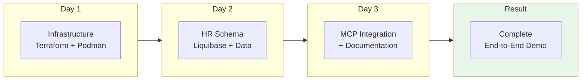

### AI-Assisted Rapid Development

- Infrastructure as Code (Terraform)
- Schema automation (Liquibase)
- AI-assisted coding (Claude Code)
- Comprehensive documentation

---

## Slide 34: Our Offer to You

### Don't Go to Your Customer with Just a PowerPoint

| Traditional Approach | Our Approach             |
| -------------------- | ------------------------ |
| Slides with promises | Live working demo        |
| "Trust us"           | "Let us show you"        |
| Weeks of preparation | Days with AI assistance  |
| Generic examples     | Your customer's use case |

### We Can Build Your Demo

- Tell us your customer's industry
- Tell us their use case
- We'll build a working POC in days
- You present with confidence

---

## Slide 35: Next Steps

### For Technical Teams

1. Download SQLcl 25.2+
2. Try with Oracle Database FREE (container)
3. Experience the MCP integration firsthand

### For Sales Teams

1. Identify customer AI initiatives
2. Map to Select AI / MCP use cases
3. Request a custom demo build

### Resources

- [SQLcl MCP Documentation](https://docs.oracle.com/en/database/oracle/sql-developer-command-line/)
- [Autonomous MCP Documentation](https://docs.oracle.com/en/cloud/paas/autonomous-database/)
- This demo repository: `github.com/[your-repo]`

---

## Slide 36: Summary

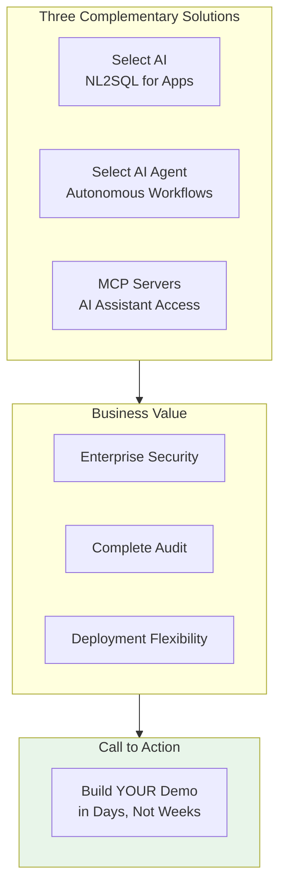

### Key Messages

1. **Oracle leads** in enterprise AI-database integration
2. **Security first** — audit, VPD, redaction built-in
3. **Choose your approach** — local or managed, query or workflow
4. **Rapid delivery** — AI-assisted demo development in days

---

## Slide 37: Thank You

# Questions?

**Contact Information**

- Victor Martin Alvarez
- victor.martin.alvarez@oracle.com

**Resources**

- Demo Repository: `https://github.com/vmleon/oracle-database-mcp-intro`
- Oracle AI Documentation: `docs.oracle.com`
