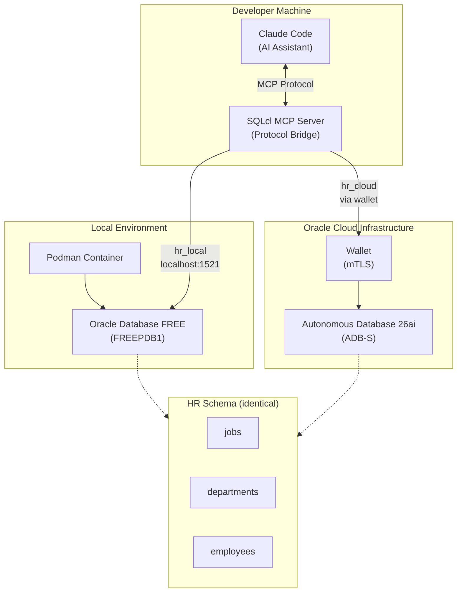

# Introduction to Oracle Database MCP for Enterprises

Demo project for Oracle Database MCP servers with dual database setup:

- **Local**: Oracle Database FREE container via Podman
- **Cloud**: Oracle Autonomous AI Database 26ai (ADB-S) on OCI

Both databases have identical HR schema deployed via Liquibase, accessible through SQLcl MCP server from Claude Code.

## Architecture



## Prerequisites

- Python 3.10+
- Podman (for local database)
- SQLcl (Oracle SQL Developer Command Line)
- Liquibase
- Terraform (for cloud database)
- OCI CLI configured (for cloud database)

## Quick Start - Local Database

```bash
# Create virtual environment
python3 -m venv venv
source venv/bin/activate
```

```bash
# Install dependencies
pip install -r requirements.txt
```

```bash
# Set up local Oracle FREE container and deploy HR schema
./manage.py local setup
```

```bash
# Configure SQLcl saved connections for Claude Code MCP
./manage.py mcp setup
```

## Quick Start - Cloud Database (Optional)

```bash
# Interactive OCI configuration
./manage.py cloud setup
```

```bash
# Deploy infrastructure
cd deploy/terraform
terraform init
terraform plan -out=tfplan
terraform apply tfplan
cd ../..
```

```bash
# Extract wallet and deploy schema
./manage.py cloud deploy
```

```bash
# Update MCP connections
./manage.py mcp setup
```

## Demo

Once setup is complete, open Claude Code from the project directory:

```bash
claude
```

Verify the MCP server is configured:

```
/mcp
```

You should see `sqlcl` listed as an active MCP server.

**Data Queries:**

```
Connect to hr_local and list all employees
```

```
Connect to hr_cloud and show employees by department with their managers
```

**Database Administration:**

```
What is the character-set of the hr_local database?
```

```
Show the database version and instance name of hr_local
```

## Management Commands

```bash
# Local database
./manage.py local setup    # Start container + deploy schema
./manage.py local clean    # Stop container, remove data
```

```bash
# Cloud database
./manage.py cloud setup    # Interactive OCI config
./manage.py cloud deploy   # Extract wallet + run Liquibase
./manage.py cloud clean    # Remove generated files
```

```bash
# MCP configuration
./manage.py mcp setup      # Save SQLcl connections
```

## HR Schema

The demo includes a simplified HR schema:

- **jobs**: Job definitions with salary ranges
- **departments**: Department information
- **employees**: Employee records with relationships

Sample data includes 5 jobs, 5 departments, and 5 employees.

## Cleanup

```bash
# Local cleanup
./manage.py local clean
```

```bash
# Terraform destroy
cd deploy/terraform && terraform destroy
```

```bash
# Cloud cleanup
./manage.py cloud clean
```
