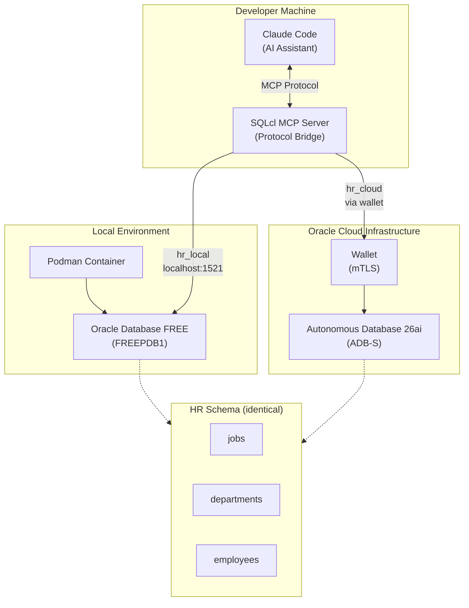

# Introduction to Oracle Database MCP for Enterprises

Demo project for Oracle Database MCP servers with dual database setup:

- **Local**: Oracle Database FREE container via Podman
- **Cloud**: Oracle Autonomous AI Database 26ai (ADB-S) on OCI

Both databases have identical HR schema deployed via Liquibase, accessible through SQLcl MCP server from Claude Code.

## Architecture


```mermaid
flowchart TB
    subgraph dev["Developer Machine"]
        CC["Claude Code<br/>(AI Assistant)"]
        MCP["SQLcl MCP Server<br/>(Protocol Bridge)"]
        CC <-->|"MCP Protocol"| MCP
    end

    subgraph local["Local Environment"]
        Podman["Podman Container"]
        ODB["Oracle Database FREE<br/>(FREEPDB1)"]
        Podman --> ODB
    end

    subgraph cloud["Oracle Cloud Infrastructure"]
        ADB["Autonomous Database 26ai<br/>(ADB-S)"]
        Wallet["Wallet<br/>(mTLS)"]
        Wallet --> ADB
    end

    MCP -->|"hr_local<br/>localhost:1521"| ODB
    MCP -->|"hr_cloud<br/>via wallet"| Wallet

    subgraph schema["HR Schema (identical)"]
        direction LR
        Jobs["jobs"]
        Depts["departments"]
        Emps["employees"]
    end

    ODB -.-> schema
    ADB -.-> schema
```

## Prerequisites

- Python 3.10+
- Podman (for local database)
- SQLcl (Oracle SQL Developer Command Line)
- Liquibase
- Terraform (for cloud database)
- OCI CLI configured (for cloud database)

## Quick Start - Local Database

Create a virtual environment:

```bash
python3 -m venv venv
```

Activate it:

```bash
source venv/bin/activate
```

Install dependencies:

```bash
pip install -r requirements.txt
```

Set up the local Oracle FREE container and deploy the HR schema:

```bash
./manage.py local setup
```

## Quick Start - Cloud Database (Optional)

Interactive OCI configuration:

```bash
./manage.py cloud setup
```

Deploy the infrastructure:

```bash
cd deploy/terraform
terraform init
terraform plan -out=tfplan
terraform apply tfplan
cd ../..
```

Extract the wallet and deploy the schema:

```bash
./manage.py cloud deploy
```

## Configure MCP Connections

Run this once the databases you want to use are ready. It creates SQLcl saved connections (`hr_local` and/or `hr_cloud`) for Claude Code MCP:

```bash
./manage.py mcp setup
```

## HR Schema

The demo includes a simplified HR schema:

- **jobs**: Job definitions with salary ranges
- **departments**: Department information
- **employees**: Employee records with relationships

Sample data includes 5 jobs, 5 departments, and 5 employees.

## Demo

Once setup is complete, open Claude Code from the project directory:

```bash
claude
```

Verify the MCP server is configured:

```
/mcp
```

You should see `sqlcl` listed as an active MCP server.

The HR schema is seeded with ~500 employees spread across 5 departments and 5 jobs. A handful of rows and the table statistics are intentionally wrong — that is part of the demo.

### Developer

```
Connect to hr_local. Explore the employees and jobs tables, then show me the average salary per department.
```

```
Find any employees whose salary is below their job's defined minimum salary. Is this a real data-quality issue?
```

### DBA / SRE

```
Connect to hr_local. Compare the real row count of the employees table with num_rows and last_analyzed in user_tables. Are the statistics current?
```

```
Which indexes exist on the employees table, and which one would be used for a query filtering by department_id?
```

### Business Analyst

```
What is the salary distribution across departments, and who are the top 3 earners in each department?
```

```
Show me the hiring trends by year across the whole company.
```

### Audit Trail

Every query an LLM runs is traceable — a core enterprise story:

```
Show me every SQL statement Claude has executed in this database in the last few minutes. Query v$sql filtered by module.
```

### Cross-Database

If you deployed the cloud database as well:

```
Compare the employees row count and the table structure between hr_local and hr_cloud.
```

## Cleanup

Local cleanup:

```bash
./manage.py local clean
```

Terraform destroy:

```bash
cd deploy/terraform
terraform destroy
cd ../..
```

Cloud cleanup:

```bash
./manage.py cloud clean
```
