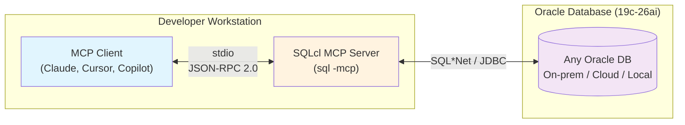
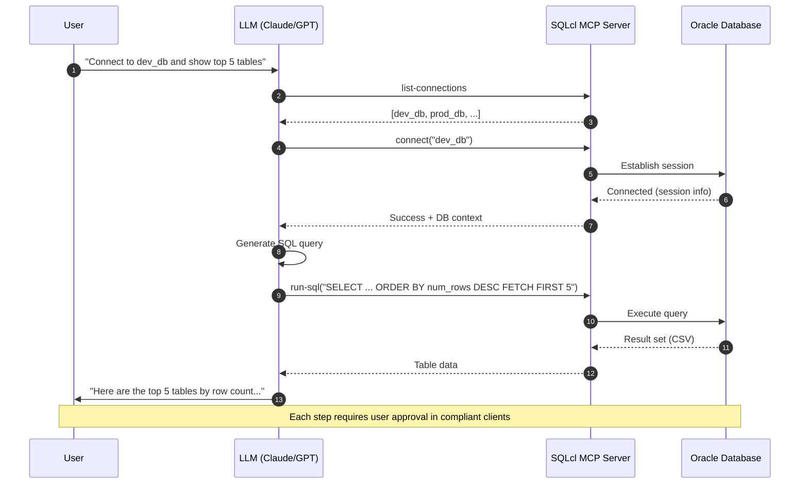
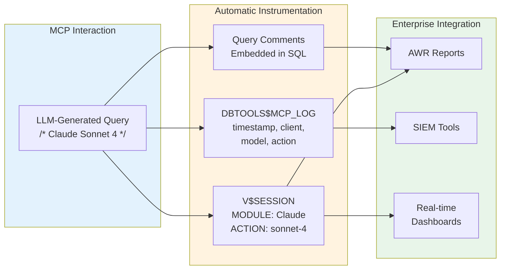
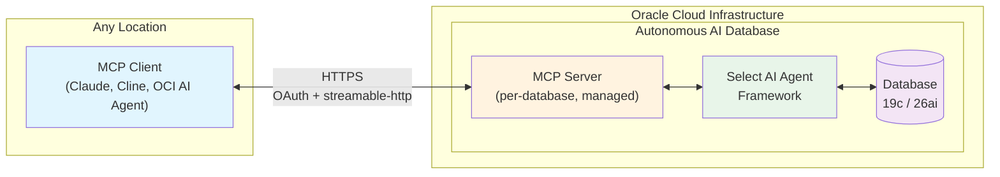
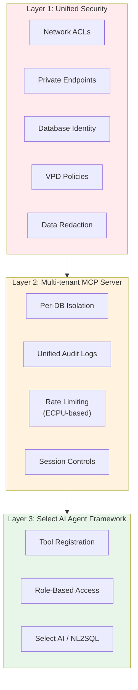
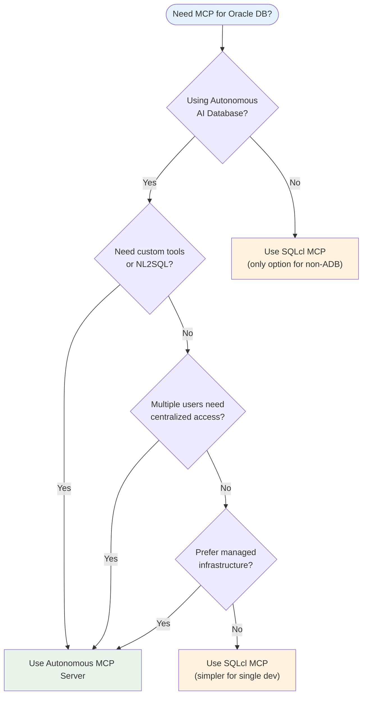
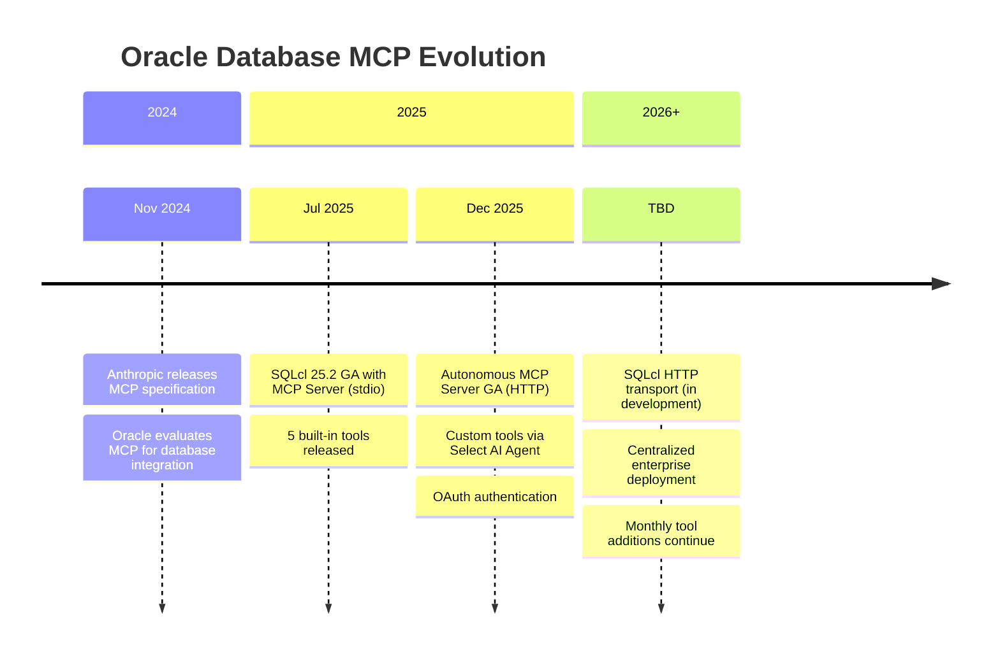
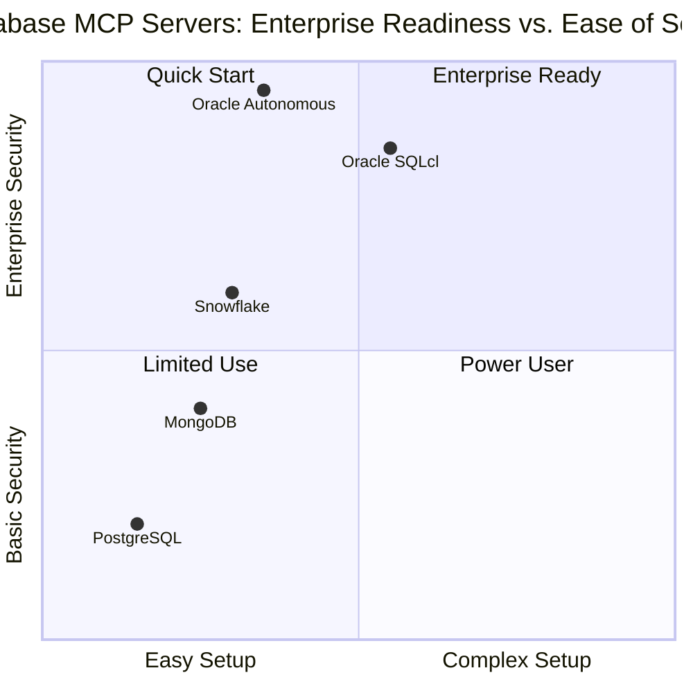

# Oracle Database MCP Server: Technical Reference

> **Purpose**: Comprehensive technical documentation covering Oracle's Model Context Protocol implementations for enterprise database-AI integration. Intended as foundation material for presentations on Oracle Database MCP servers, enterprise readiness, and industry use cases.

---

## Executive Summary

Oracle provides **two MCP server implementations** for connecting LLMs to Oracle Database, each targeting different deployment scenarios:

| Implementation            | Transport     | Release              | Target Use Case                           |
| ------------------------- | ------------- | -------------------- | ----------------------------------------- |
| **SQLcl MCP Server**      | stdio (local) | GA July 2025 (v25.2) | Any Oracle DB, developer workstations     |
| **Autonomous MCP Server** | HTTP (remote) | GA December 2025     | Enterprise, centralized multi-user access |

Oracle evaluated Anthropic's Model Context Protocol shortly after its November 2024 introduction and recognized its potential for standardizing LLM-database interactions. Rather than building separate products, Oracle embedded MCP capabilities into existing infrastructure — SQLcl for broad compatibility and Autonomous Database for managed enterprise deployments.

**Key differentiator from competitors**: Oracle's implementations lead the market in security instrumentation, with automatic session tracking, query tagging, comprehensive audit logging, and native integration with Oracle's security stack (VPD, Data Redaction, SQL Firewall, Database Vault).

---

## Part 1: SQLcl MCP Server (Local)

### Architecture Overview

The SQLcl MCP Server uses a **local server model** with stdio transport and JSON-RPC 2.0 messaging. When launched with the `-mcp` flag, SQLcl transforms into an MCP server that communicates through standard input/output streams. This design keeps database credentials and connections local to the user's machine while allowing any MCP-compatible client to interact with Oracle databases.



### Exposed Tools

The server exposes exactly **five tools** with no mechanism for custom tool registration:

| Tool               | Purpose                                                                 | Parameters        |
| ------------------ | ----------------------------------------------------------------------- | ----------------- |
| `list-connections` | Discovers saved named connections in the local connection store         | None              |
| `connect`          | Establishes session using a saved connection with stored credentials    | `connection_name` |
| `disconnect`       | Cleanly terminates the active database session                          | None              |
| `run-sql`          | Executes SQL queries and PL/SQL blocks, returning CSV-formatted results | `sql_statement`   |
| `run-sqlcl`        | Runs SQLcl-specific commands including Data Pump, Data Guard, AWR       | `command`         |

**Design rationale**: The fixed tool set focuses on execution capabilities rather than pre-packaged context. While users cannot add custom tools directly, `run-sql` can execute any SQL including calls to custom PL/SQL functions, providing extensibility through database-side logic.

### Prerequisites

| Requirement     | Details                                                                      |
| --------------- | ---------------------------------------------------------------------------- |
| SQLcl           | Version 25.2 or later                                                        |
| Java            | Version 17 or 21 specifically (other versions may cause startup failures)    |
| Oracle Database | 19c, 21c, 23ai, or 26ai — on-premises, cloud, or local                       |
| MCP Client      | Claude Desktop, VS Code Copilot, Cursor, Cline, or any MCP-compatible client |

### Setup Guide

#### Step 1: Install SQLcl

Download from [oracle.com/sqlcl](https://www.oracle.com/database/sqldeveloper/technologies/sqlcl/) or install the SQL Developer Extension for VS Code (includes SQLcl).

```bash
# Verify installation
sql -V
# Expected: SQLcl: Release 25.2 (or higher)

# Verify Java version
java -version
# Must be 17.x or 21.x
```

#### Step 2: Create Saved Connections with Passwords

**Critical requirement**: The MCP server only works with saved connections that include stored passwords.

```sql
# Start SQLcl
sql /nolog

# Save connection with password (-savepwd is essential)
SQL> conn -save dev_db -savepwd scott/tiger@localhost:1521/freepdb1

# For Autonomous Database with wallet
SQL> conn -save adb_dev -savepwd admin/YourPassword@myatp_low?TNS_ADMIN=/path/to/wallet

# Verify saved connections
SQL> conn -list
```

#### Step 3: Configure MCP Client

**Claude Desktop** (`~/Library/Application Support/Claude/claude_desktop_config.json` on macOS):

```json
{
  "mcpServers": {
    "oracle": {
      "command": "/path/to/sqlcl/bin/sql",
      "args": ["-mcp"]
    }
  }
}
```

**VS Code with GitHub Copilot**:

1. Install SQL Developer Extension for VS Code (version 25.2+)
2. The MCP server auto-registers with Copilot upon extension activation
3. Set Copilot to **Agent mode**
4. Create at least one saved database connection

**Cursor IDE** (`~/.cursor/mcp.json`):

```json
{
  "mcpServers": {
    "oracle": {
      "command": "/path/to/sqlcl/bin/sql",
      "args": ["-mcp"]
    }
  }
}
```

**Cline**: Use `cline_mcp_settings.json` with the same structure, or use SQL Developer Extension's "Add to Cline" feature.

#### Step 4: Verify and Test

After restarting your MCP client, test with a prompt like:

```
"Connect to dev_db and show me the top 5 largest tables by row count"
```

The LLM will orchestrate tool calls in sequence:



**Always review proposed SQL before approving execution.**

### Security Instrumentation

SQLcl MCP provides comprehensive audit capabilities that distinguish it from other database MCP servers:



**V$SESSION Tracking**:

- `MODULE` column populated with MCP client name (e.g., "Claude")
- `ACTION` column contains LLM model version

**Query Tagging**:
All LLM-generated queries include embedded comments:

```sql
/* LLM in use is Claude Sonnet 4 */ SELECT * FROM employees WHERE ...
```

This makes queries instantly identifiable in:

- AWR reports
- SQL execution logs
- SIEM tool integrations
- Real-time monitoring dashboards

**DBTOOLS$MCP_LOG Table**:
Automatically records all interactions including:

- MCP client identifier
- Model name and version
- Endpoint type
- Action name
- Detailed log messages with timestamps

**Important**: This table does not include automatic cleanup routines. Organizations must implement regular purge jobs to prevent database saturation.

### Known Limitations

| Limitation            | Details                        | Workaround                             |
| --------------------- | ------------------------------ | -------------------------------------- |
| Local only            | No remote/HTTP transport       | Use Autonomous MCP for remote access   |
| Fixed 5 tools         | Cannot register custom tools   | Use `run-sql` to call PL/SQL functions |
| Version compatibility | SQLcl 25.4 crashes Amazon Kiro | Use SQLcl 25.3.2 for Kiro              |
| Java strict           | Only Java 17 or 21             | Set `JAVA_HOME` explicitly             |

---

## Part 2: Autonomous MCP Server (Remote)

### Architecture Overview

The Autonomous MCP Server is a **fully managed, multi-tenant** feature built into Oracle Autonomous AI Database. Released December 2025, it uses HTTP transport (`streamable-http`) for true remote access — the capability SQLcl is still working toward.



### Three-Layer Security Architecture



**Layer 1: Unified Security**

- Network ACLs and Private Endpoint enforcement
- Database identity integration (no separate credential stores)
- VPD (Virtual Private Database) policy enforcement
- Data Redaction for sensitive field masking

**Layer 2: Multi-tenant MCP Server**

- Per-database isolation
- All interactions logged to unified audit logs
- Rate limiting and DoS protection based on ECPU allocation
- Session-level access controls

**Layer 3: Select AI Agent Framework**

- Tool-level registration and lifecycle management
- Role-based permissions on individual tools
- Integration with Select AI for NL2SQL capabilities

### Key Advantages Over SQLcl MCP

| Capability           | SQLcl MCP               | Autonomous MCP            |
| -------------------- | ----------------------- | ------------------------- |
| Transport            | stdio (local)           | HTTP (remote)             |
| Custom tools         | No                      | Yes (DBMS_CLOUD_AI_AGENT) |
| Infrastructure       | User-managed            | Fully managed             |
| Multi-user           | No (single workstation) | Yes (centralized)         |
| NL2SQL integration   | No                      | Yes (Select AI profiles)  |
| OAuth authentication | No                      | Yes                       |

### Decision Guide: Which Implementation to Use



### Prerequisites

| Requirement            | Details                                                |
| ---------------------- | ------------------------------------------------------ |
| Autonomous AI Database | Serverless infrastructure only                         |
| Database Version       | 19c or 26ai                                            |
| MCP Client             | Claude Desktop, Cline, OCI AI Agent, or any MCP client |
| Network                | Public endpoint or Private Endpoint configured         |

### Setup Guide

#### Step 1: Enable MCP Server

A DBA or ADMIN user enables MCP via **OCI free-form tags**:

**Via OCI Console**:

1. Navigate to Autonomous Database → Your Instance
2. Click **More Actions** → **Add Tags**
3. Add free-form tag:
   - Tag Key: `mcp_server`
   - Tag Value: `enabled`

**Via OCI CLI**:

```bash
oci db autonomous-database update \
  --autonomous-database-id <your-adb-ocid> \
  --freeform-tags '{"mcp_server": "enabled"}'
```

#### Step 2: Register Custom Tools

Unlike SQLcl's fixed tools, Autonomous MCP allows custom tool registration:

```sql
-- Connect as ADMIN or privileged user
BEGIN
  DBMS_CLOUD_AI_AGENT.CREATE_TOOL(
    tool_name        => 'get_customer_orders',
    description      => 'Returns order history for a customer by email',
    tool_type        => 'SQL',
    tool_spec        => '{
      "sql": "SELECT * FROM orders WHERE customer_email = :email ORDER BY order_date DESC",
      "parameters": {
        "email": {"type": "string", "description": "Customer email address"}
      }
    }'
  );
END;
/
```

**NL2SQL-enabled tools** via Select AI profiles:

```sql
BEGIN
  DBMS_CLOUD_AI.CREATE_PROFILE(
    profile_name => 'SALES_PROFILE',
    attributes   => '{"provider": "openai", "model": "gpt-4"}',
    description  => 'Profile for sales data queries'
  );
END;
/

-- Now natural language queries can be processed:
-- SELECT AI 'What are my top 10 customers by revenue?'
```

**Key advantage**: NL2SQL Select AI-enabled tools bypass the typical schema discovery process, allowing optimized SQL generation using an AI profile that may use different LLMs specifically tuned for SQL quality.

#### Step 3: Obtain MCP Server Endpoint

Endpoint URL pattern:

```
https://dataaccess.adb.{region}.oraclecloudapps.com/adb/mcp/v1/databases/{db-ocid}
```

Find your DB OCID in OCI Console → Autonomous Database → Your Instance.

#### Step 4: Configure Authentication

**Option A: Interactive Login**

When using Claude Desktop, a login screen appears automatically for database credentials.

**Option B: Token-Based Authentication**

Generate an OAuth token (valid 1 hour):

```bash
curl --location \
  'https://dataaccess.adb.{region}.oraclecloudapps.com/adb/auth/v1/databases/{db-ocid}/token' \
  --header 'Content-Type: application/json' \
  --data '{
    "grant_type": "password",
    "username": "ADMIN",
    "password": "YourSecurePassword"
  }'
```

Response:

```json
{
  "access_token": "eyJhbGciOiJSUzI1NiIs...",
  "token_type": "Bearer",
  "expires_in": 3600
}
```

#### Step 5: Configure MCP Client

**Claude Desktop** (requires `mcp-remote` bridge for HTTP transport):

```json
{
  "mcpServers": {
    "oracle_adb": {
      "command": "npx",
      "args": [
        "-y",
        "mcp-remote",
        "https://dataaccess.adb.us-ashburn-1.oraclecloudapps.com/adb/mcp/v1/databases/ocid1.autonomousdatabase.oc1.iad.yourdbocid",
        "--allow-http"
      ],
      "transport": "streamable-http"
    }
  }
}
```

### VPD Policy Example for Data Isolation

```sql
-- Create policy function
CREATE OR REPLACE FUNCTION sales_region_policy (
  schema_name IN VARCHAR2,
  table_name  IN VARCHAR2
) RETURN VARCHAR2 AS
BEGIN
  RETURN 'region = SYS_CONTEXT(''USERENV'', ''CLIENT_INFO'')';
END;
/

-- Apply policy
BEGIN
  DBMS_RLS.ADD_POLICY(
    object_schema   => 'SALES',
    object_name     => 'ORDERS',
    policy_name     => 'REGION_FILTER',
    function_schema => 'ADMIN',
    policy_function => 'sales_region_policy'
  );
END;
/
```

---

## Part 3: Enterprise Readiness Assessment

### Security Feature Matrix

| Security Capability          | SQLcl MCP               | Autonomous MCP      | Enterprise Impact        |
| ---------------------------- | ----------------------- | ------------------- | ------------------------ |
| Session tracking (V$SESSION) | ✓                       | ✓                   | Real-time monitoring     |
| Query tagging (comments)     | ✓                       | ✓                   | AWR/SIEM integration     |
| Dedicated audit table        | ✓ (DBTOOLS$MCP_LOG)     | ✓ (Unified Audit)   | Compliance reporting     |
| OAuth authentication         | ✗                       | ✓                   | SSO integration          |
| Network ACLs                 | Via DB firewall         | Native              | Zero-trust architecture  |
| Private Endpoints            | Via network config      | Native              | VCN isolation            |
| VPD integration              | ✓                       | ✓                   | Row-level security       |
| Data Redaction               | ✓                       | ✓                   | PII masking              |
| SQL Firewall                 | ✓                       | ✓                   | Injection prevention     |
| Database Vault               | ✓                       | ✓                   | Privileged user controls |
| Rate limiting                | Via DB Resource Manager | Native (ECPU-based) | DoS protection           |

### Audit and Compliance

**SQLcl MCP Audit Trail**:

```sql
-- Query MCP activity log
SELECT timestamp, mcp_client, model_name, action_name, log_message
FROM dbtools$mcp_log
WHERE timestamp > SYSDATE - 1
ORDER BY timestamp DESC;

-- Correlate with V$SESSION for real-time monitoring
SELECT sid, serial#, module, action, sql_id, last_call_et
FROM v$session
WHERE module LIKE '%Claude%' OR module LIKE '%Copilot%';
```

**Autonomous MCP Audit Trail**:

```sql
-- Unified audit query
SELECT event_timestamp, dbusername, action_name, sql_text
FROM unified_audit_trail
WHERE application_contexts LIKE '%MCP%'
ORDER BY event_timestamp DESC;
```

### Roadmap: SQLcl HTTP Transport



Oracle has confirmed work on **remote server support using HTTP** for SQLcl MCP, which will enable:

- Centralized deployment (single server, multiple clients)
- Enterprise-wide access without local SQLcl installation
- Consistent architecture with Autonomous MCP

**Current workaround** for centralized SQLcl deployment: Red Hat OpenShift containerization with stdio-to-HTTP proxy using container image `quay.io/rh-ai-quickstart/oracle-sqlcl:0.5.11`.

No official release date announced. Oracle commits to **monthly SQLcl updates** adding new MCP tools.

---

## Part 4: Practical Use Cases

### Use Case 1: Ad-Hoc Business Reporting

**Scenario**: Non-technical business users query databases using natural language without writing SQL.

**Example interaction**:

```
User: "What are the most watched shows in my NETFLIX collection?"
LLM: [connects, generates SQL, executes, summarizes results]
```

**Benefits**: Eliminates report backlog, empowers self-service analytics.

### Use Case 2: Automated Database Performance Tuning

**Scenario**: DBA asks Claude to identify and tune problematic queries.

**Example interaction**:

```
User: "Find the worst query in my database and help me tune it"
LLM: [runs 16 queries against performance views, identifies issues, provides recommendations]
```

**Documented cost**: ~$0.43 in API fees for comprehensive analysis.

### Use Case 3: Compliance and Audit Reporting

**Scenario**: Generate compliance reports by querying audit logs with natural language.

**Example interaction**:

```
User: "Show me all privileged user access to HR data in the last 30 days"
LLM: [queries unified_audit_trail, formats report]
```

### Use Case 4: Data Migration Assistance

**Scenario**: Use `run-sqlcl` tool to orchestrate Data Pump operations.

**Example interaction**:

```
User: "Export the SALES schema to a dump file for migration"
LLM: [generates and executes Data Pump export command via run-sqlcl]
```

---

## Part 5: Competitive Analysis

### Database MCP Server Comparison

| Aspect                  | Oracle SQLcl                | Oracle Autonomous | PostgreSQL (Anthropic) | Snowflake (Managed) | MongoDB (Official)    |
| ----------------------- | --------------------------- | ----------------- | ---------------------- | ------------------- | --------------------- |
| **Transport**           | stdio                       | HTTP              | stdio                  | HTTP                | stdio                 |
| **Read/Write**          | Both                        | Both              | Read-only              | Both                | Both                  |
| **Audit Logging**       | V$SESSION + dedicated table | Unified Audit     | None                   | OAuth RBAC          | Confirmation required |
| **Query Tagging**       | Automatic comments          | Automatic         | None                   | None                | None                  |
| **Custom Tools**        | No                          | Yes               | No                     | Yes                 | Yes                   |
| **Advanced Features**   | Data Pump, AWR, Data Guard  | Select AI, NL2SQL | Basic queries          | Cortex AI services  | Atlas management      |
| **Setup Complexity**    | Moderate                    | Low (managed)     | Low (npx)              | Low (managed)       | Low (npm)             |
| **Enterprise Security** | Comprehensive               | Comprehensive     | Basic                  | Good                | Good                  |

### Competitive Positioning



### Oracle's Competitive Advantages

1. **Security instrumentation**: Most comprehensive audit capabilities in the market
2. **Native tooling**: Leverages decades of SQLcl development
3. **DBA capabilities**: Access to Data Pump, AWR, Data Guard unavailable elsewhere
4. **Converged database**: Single MCP connection accesses relational, JSON, graph, spatial, vector data
5. **Existing security stack**: VPD, Redaction, SQL Firewall, Database Vault work seamlessly

### Competitive Gaps

1. **Custom tool registration** (SQLcl only): Cannot add tools beyond the five built-in
2. **Local-only deployment** (SQLcl): No remote access without containerization workaround
3. **Setup complexity**: More steps than `npx @anthropic/postgres-mcp`

---

## Part 6: Security Best Practices

### Database User Configuration

```sql
-- Create restricted user for MCP access
CREATE USER mcp_reader IDENTIFIED BY "SecurePass123";

-- Minimal privileges
GRANT CREATE SESSION TO mcp_reader;
GRANT SELECT ON hr.employees TO mcp_reader;
GRANT SELECT ON hr.departments TO mcp_reader;

-- Explicitly deny write operations
-- (No INSERT, UPDATE, DELETE grants)

-- Optional: Add SQL Firewall protection
BEGIN
  DBMS_SQL_FIREWALL.CREATE_CAPTURE(
    username => 'MCP_READER',
    top_level_only => TRUE,
    start_capture => TRUE
  );
END;
/
```

### Deployment Recommendations

| Environment | Recommendation                                         |
| ----------- | ------------------------------------------------------ |
| Development | SQLcl MCP with local database or ADB-Free              |
| Testing     | SQLcl MCP with read-only replica                       |
| Production  | Autonomous MCP with Private Endpoint, VPD policies     |
| Multi-user  | Autonomous MCP (HTTP transport) or containerized SQLcl |

### Operational Guidelines

1. **Never auto-approve**: Always review generated SQL before execution
2. **Read-only replicas**: Route LLM access to replicas, not production masters
3. **Implement log rotation**: Purge DBTOOLS$MCP_LOG regularly
4. **Monitor costs**: Track API usage, especially for complex analytical queries
5. **Regular audits**: Review what queries LLMs are generating weekly
6. **Least privilege**: Create dedicated users with minimal SELECT-only access
7. **Network isolation**: Use Private Endpoints for Autonomous, firewalls for on-prem

---

## Part 7: Troubleshooting Reference

### SQLcl MCP Issues

| Symptom                | Cause                      | Resolution                                                      |
| ---------------------- | -------------------------- | --------------------------------------------------------------- |
| "No connections found" | Missing `-savepwd`         | Re-save: `conn -save mydb -savepwd user/pass@host:1521/service` |
| Java errors on startup | Wrong Java version         | Use Java 17 or 21 only; set `JAVA_HOME`                         |
| Kiro crashes           | SQLcl 25.4 incompatibility | Downgrade to SQLcl 25.3.2                                       |
| Tools not appearing    | Client not restarted       | Fully restart MCP client after config change                    |
| Connection timeout     | Network/firewall           | Verify SQL\*Net connectivity independently                      |

### Autonomous MCP Issues

| Symptom              | Cause               | Resolution                                      |
| -------------------- | ------------------- | ----------------------------------------------- |
| "Connection refused" | MCP not enabled     | Add OCI tag `mcp_server: enabled`               |
| "Tool not found"     | Tool not registered | Verify with `SELECT * FROM user_ai_agent_tools` |
| "Unauthorized"       | Token expired       | Regenerate OAuth token (1-hour validity)        |
| Network errors       | ACL blocking        | Add client IP to network ACL                    |
| Slow responses       | ECPU throttling     | Increase ECPU allocation                        |

---

## Appendix: Quick Reference

### SQLcl MCP Command Reference

```bash
# Start as MCP server
sql -mcp

# Save connection with password
sql> conn -save <name> -savepwd <user>/<pass>@<connect_string>

# List saved connections
sql> conn -list

# Test connection
sql> conn <name>
```

### Configuration File Locations

| Client         | Platform  | Path                                                              |
| -------------- | --------- | ----------------------------------------------------------------- |
| Claude Desktop | macOS     | `~/Library/Application Support/Claude/claude_desktop_config.json` |
| Claude Desktop | Windows   | `%APPDATA%\Claude\claude_desktop_config.json`                     |
| Cursor         | Global    | `~/.cursor/mcp.json`                                              |
| Cursor         | Workspace | `.cursor/mcp.json`                                                |
| Cline          | VS Code   | `cline_mcp_settings.json`                                         |

### Key URLs

- [SQLcl MCP Documentation](https://docs.oracle.com/en/database/oracle/sql-developer-command-line/25.2/sqcug/using-oracle-sqlcl-mcp-server.html)
- [Autonomous MCP Documentation](https://docs.oracle.com/en/cloud/paas/autonomous-database/serverless/adbsb/about-mcp-server.html)
- [Oracle Blog: Introducing MCP Server](https://blogs.oracle.com/database/introducing-mcp-server-for-oracle-database)
- [Oracle Blog: Autonomous AI Database MCP Server](https://blogs.oracle.com/machinelearning/announcing-the-oracle-autonomous-ai-database-mcp-server)
- [Jeff Smith's Getting Started Guide](https://www.thatjeffsmith.com/archive/2025/07/getting-started-with-our-mcp-server-for-oracle-database/)
- [SQLcl Download](https://www.oracle.com/database/sqldeveloper/technologies/sqlcl/)

---

_Document Version: 1.0 | Last Updated: January 2026_
